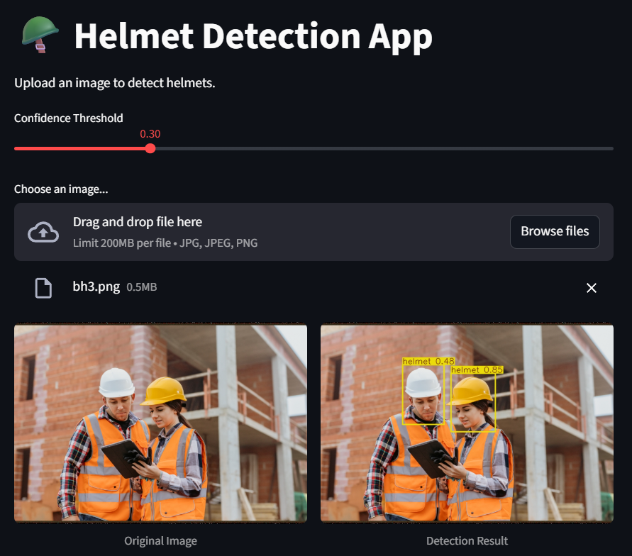

# Safety Helmet Detection with YOLOv10

A fine-tuned YOLOv10n model trained to detect safety helmets, bare heads, and persons in workplace images. Includes a Streamlit web app for interactive inference.

Below is the deployed application interface:



## Overview

This project fine-tunes a pretrained YOLOv10n checkpoint on a custom Safety Helmet Dataset to classify three object categories: `head`, `helmet`, and `person`. Training was run on Google Colab with a T4 GPU for 50 epochs.

## Results

| Class   | Precision | Recall | mAP50 | mAP50-95 |
|---------|-----------|--------|-------|----------|
| all     | 0.779     | 0.752  | 0.832 | 0.443    |
| head    | 0.827     | 0.599  | 0.815 | 0.372    |
| helmet  | 0.784     | 0.852  | 0.896 | 0.477    |
| person  | 0.726     | 0.804  | 0.785 | 0.480    |

Evaluated on the held-out test split (109 images, 320 instances).

## Project Structure

```
.
├── yolov10/                  # Cloned YOLOv10 source
├── safety_helmet_dataset/    # Unzipped dataset
│   ├── train/
│   ├── valid/
│   ├── test/
│   └── data.yaml
├── runs/detect/              # Training and validation outputs
├── app.py                    # Streamlit inference app
├── best.pt                   # Best trained model weights
└── requirements.txt
```

## Setup

**1. Clone YOLOv10 and install dependencies**

```bash
git clone https://github.com/THU-MIG/yolov10.git
cd yolov10
pip install -r requirements.txt
pip install -e .
cd ..
```

**2. Download the pretrained base model**

```bash
wget https://github.com/THU-MIG/yolov10/releases/download/v1.1/yolov10n.pt -P yolov10/
```

**3. Download the dataset**

```bash
gdown '1twdtZEfcw4ghSZIiPDypJurZnNXzMO7R'
mkdir safety_helmet_dataset
unzip Safety_Helmet_Dataset.zip -d safety_helmet_dataset/
```

If the `gdown` link is rate-limited, download the file manually from Google Drive and place it in the working directory.

**4. Install app dependencies**

```bash
pip install -r requirements.txt
```

## Training

```python
from ultralytics import YOLO

model = YOLO('yolov10/yolov10n.pt')
model.train(
    data='safety_helmet_dataset/data.yaml',
    epochs=50,
    batch=64,
    imgsz=640
)
```

Reduce `batch` to 32, 16, or 8 if you run out of GPU memory.

## Evaluation

```python
model = YOLO('runs/detect/train2/weights/best.pt')
model.val(data='safety_helmet_dataset/data.yaml', imgsz=640, split='test')
```

## Running the App

Place `best.pt` in the same directory as `app.py`, then run:

```bash
streamlit run app.py
```

Upload a JPG or PNG image and adjust the confidence threshold slider to view detections.

## Requirements

```
streamlit
ultralytics
pillow
numpy
```

## Notes

- A GPU runtime is strongly recommended. In Google Colab, go to **Runtime > Change runtime type > GPU**.
- Training logs and weight checkpoints are saved to `runs/detect/`.
- The model was trained with image size 640 and the AdamW optimizer (lr=0.001429).